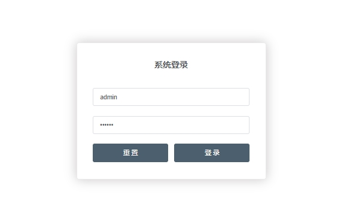

## 目录
- [KittyUI开发笔记](#kittyui开发笔记)
  - [搭建开发环境](#搭建开发环境)
  - [创建项目](#创建项目)
  - [工具模块封装](#工具模块封装)
    - [axios封装](#axios-封装)
    - [mock封装](#mock-封装)
  - [登录](#登录)
  - [国际化](#国际化)
  - [主题](#主题)
    - [动态换肤](#动态换肤)
  - [功能组件封装](#功能组件封装)
  - [管理应用状态](#管理应用状态)

## KittyUI开发笔记

  作者：ZhangShuang

  版本：ZS 1.0.0

  版权：ZhangShuang

### 搭建开发环境

#### 技术基础

- vue2
- vue-router
- vuex
- Element UI
- Sass
- Mock
- Webpack

#### 开发环境

- Node.js（npm）== 14.13.1
- WebStorm

### 创建项目

- 使用脚手架创建项目
  ``` powershell
    # 通过 vue-cli 来生成一个项目，名称为 kitty-ui
    vue init webpack kitty-ui
    # 进入到项目根目录，执行 npm install (也可以用 yarn install，或淘宝 cnpm install) 安装依赖包。
    # 依赖包安装完成之后，会在项目根目录下生成 node_modules 文件夹，是下载的依赖包的统一存放目录
    cd kitty -ui
    npm install
    # 安装完成之后，执行应用启动命令，运行项目
    npm run dev
    # 命令执行之后，如果显示 “I Your application is runing here ....”，就表示启动成功了。
    # 浏览器访问对应地址，如这里的: http://localhost:8080，会出现 vue 的介绍页面。
  ```
- 引入 `ElementUI`
  - 安装
  ``` powershell
    # 安装element
    npm i element-ui -s
  ```
  - 导入
  ```js
    // 在 main.js 中引入element
    import ElementUI from 'element-ui'
    // import 'element-ui/lib/theme-chalk/index.css'
    import '@/theme/theme-67da9a/index.css'

    Vue.use(ElementUI)
  ```
- 创建路由
  - 添加页面：将 components 文件夹改名为 views，并在 views 目录下添加三个页面，Login.vue，Home.vue，404.vue。例：Login.vue
  ``` vue
    <template>
      <div class="page">
        <h2>Login Page</h2>
      </div>
    </template>

    <script>
    export default {
      name: 'Login'
    }
    </script>
  ```
  - 配置路由：打开 router/index.js，添加三个路由，分别对应主页、登录和 404 页面。
- 安装scss
  - 安装对应 node 版本的 node-sass
    - 
  - 安装对应 node-sass 版本的 sass-loader
    - 
  - 添加配置
  ``` js
    // 在build文件夹下的webpack.base.conf.js的 rules 标签下添加配置。
    {
    　　test: /\.scss$/,
    　　loaders: ['style', 'css', 'sass']
    }
  ```
  - 使用：在页面代码 style 标签中把 lang 设置成 scss 即可
  - 测试
- 安装 axios
``` powershell
  # axios 是一个基于 Promise 用于浏览器和 nodejs 的 HTTP 客户端，我们后续需要用来发送 http 请求。
  npm i axios
```
- 安装 mock.js
> 为了模拟后台接口提供页面需要的数据，引入 Mock.js 提供模拟数据，而不用依赖于后台接口的完成。
  - 安装
  ```powershell
    npm i mockjs --dev
  ```
  - 在 src 目录下新建一个 mock 目录，创建 mock.js
  ```js
    import Mock from 'mockjs'

    // login
    Mock.mock('http://127.0.0.1:8080/login', {
      data: {
        'token': '17852665544444',
        'userName': 'zs',
        'userPwd': '123456789',
        'others': ''
      }
    })
  ```


### 工具模块封装

#### axios 封装

> 使用axios发起一个请求是比较简单的事情，但是axios没有进行封装复用，项目越来越大，会引起越来越多的代码冗余，让代码变得越来越难维护。所以我们在这里先对 axios 进行二次封装，使项目中各个组件能够复用请求，让代码变得更容易维护。
>> - 要点：
>>  - 统一 url 配置
>>  - 统一 api 请求
>>  - request (请求) 拦截器，例如：带上token等，设置请求头
>>  - response (响应) 拦截器，例如：统一错误处理，页面重定向等
>>  - 根据需要，结合 Vuex 做全局的 loading 动画，或者错误处理
>>  - 将 axios 封装成 Vue 插件使用

- 在 src 目录下，新建一个 http 文件夹，用来存放 http 交互 api 代码。
  - config.js：axios 默认配置，包含基础路径等信息。
  - axios.js：二次封装 axios 模块，包含拦截器等信息。
  - interface.js ：请求接口汇总模块，聚合模块 API。
  - index.js：将 axios 封装成插件，按插件方式引入。
- 安装 js-cookie（axios.js 中，会用到 Cookie 获取 token）
- 在 main.js 中以 vue 插件的形式引入 axios，这样在其他地方就可通过 this.$api 调用相关的接口了
- 在 interface.js 中添加 login 接口
- 在登录界面 Login.vue 中，添加一个登录按钮，点击处理函数通过 axios 调用 login 接口返回数据。 成功返回之后，将 token 放入 Cookie 并跳转到主页。
- 在 mock.js 中添加 login 接口进行拦截，返回一个 token。

#### mock 封装

> 为了统一可以统一管理和集中控制数据模拟接口，我们对 mock 模块进行了封装，可以方便的定制模拟接口的统一开关和个体开关。

- 在 mock 目录下新建一个 index.js ，创建 modules 目录并在里面创建三个模块 *.js 文件。
  - index.js：模拟接口模块聚合文件
  - login.js：登录相关的接口模拟
  - user.js：用户相关的接口模拟
  - menu.js：菜单相关的接口模拟

### 登录

- 丰富登录界面
  - 从 Element 指南中选择组件模板丰富登录界面，放置一个登录界面表单，包含账号密码输入框和登录重置按钮。
  - 调整一下界面样式
  - 添加页面组件显示规则和操作响应，其中登录成功后，把登录用户信息存储到本地会话，用于配置路由跳转目标。
  - 
- 修改 http/interface.js，把请求类型改为 post，并传入 data 参数。
- 修改 mock/modules/logins.js，把请求类型改为 post。
- 添加导航守卫：在 router/index.js 中添加导航守卫，如下图所示，根据用户登录会话记录，路由到主页或登录界面。
- 修改主页面（home）
  - 向 home.vue 添加组件，构建主界面
  - 处理页面事件和页面数据显示，主要是两个事件和在 mounted 函数内获取页面数据。
  - 修饰调整 css 样式
  - 
- 嵌套路由
  - 在 views 目录下新建 Main、User、Menu 页面，用于菜单路由
  - 在 router/index.js 文件中添加子路由，分别指向子页面
  - 在 views/Home.vue 页面对应的导航菜单中添加点击事件，路由到对应的子页面
    - *这里发现点击导航菜单之后，菜单就不能点击了，经查看是导航页面坐标样式问题，把用户管理等页面的样式去掉就好了*

### 国际化

> 使用 `i18n` 实现国际化

- 安装依赖
```powershell
  npm i vue-i18n
```
- 添加配置
  - 在 src 下新建 i18n 目录，并创建一个 index.js
  - 在 assets 目录下面创建连个多语言文件
  - 在 main.js 中引入 i18n 并注入到 vue 对象中
- 在原本使用字符串的地方，引入国际化字符串
- 在用户信息前边添加一个用于语言切换的菜单，用于切换不同的语言。
- 菜单语言切换的时候，修改国际化的设置

### 主题

- 安装主题工具
``` powershell
  npm i element-theme --dev
```
- 安装chalk主题
``` powershell
  npm i element-theme-chalk -D
```
- 初始化变量文件
``` powershell
  # 主题生成工具安装成功后，如果全局安装可以在命令行里通过 et 调用工具，如果安装在当前目录下，需要通过 node_modules/.bin/et 访问到命令。执行 -i 初始化变量文件。默认输出到 element-variables.scss，当然你可以传参数指定文件输出目录。
  node_modules/.bin/et -i
  # 命令执行成功之后，会在根目录生成 scss文件 element-variables.scss
```
- 修改主题色：在 element-variables.scss 文件里修改 $–color-primary:#4b5f6e，即你想要的主题颜色
- 编译主题
``` powershell
  #  执行主题编译命令生成主题，根目录会生成一个theme的文件夹 。
  node_modules/.bin/et
```
- 引入自定义主题
  - 把生成的主题按颜色改名放置 src/theme 目录下。
  - 在 main.js 中 import ‘所在路径/index.css’

#### 动态换肤

- src/components 创建 ThemePicker 文件夹 下创建 index.vue文件
- 使用 ElementUI 的 el-color-picker 选择颜色

### 功能组件封装

### 管理应用状态
